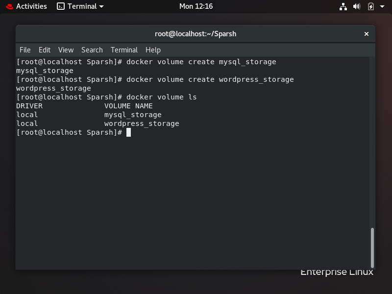
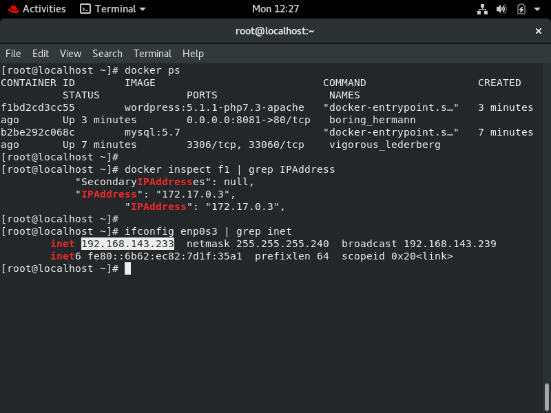

`BaseImage` *mysql:5.7* and *wordpress:5.1.1-php7.3-apache*   
* It will bring up all the services and run them.
* It creates a network for all the services in the compose file and expose the wordpress service on port 8081.
* It will download the specified images if not already downloaded.  
* Infrastructure As Code with PATing (port address translation).

`For Docker volumes`  

  

`For Container Info and IPs`

  

`Sample without PATing`

  
